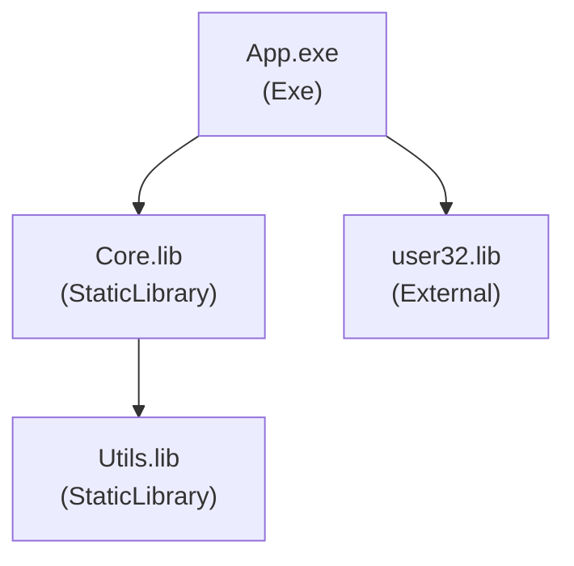

# Solution Dependency Mapper - Architecture Document

## Table of Contents
1. [Overview](#overview)
2. [System Architecture](#system-architecture)
3. [Core Components](#core-components)
4. [Feature Specifications](#feature-specifications)
5. [Data Models](#data-models)
6. [Output Formats](#output-formats)
7. [Technical Requirements](#technical-requirements)
8. [Implementation Details](#implementation-details)
9. [Future Extensions](#future-extensions)

---

## Overview

### Purpose
The Solution Dependency Mapper is a cross-platform .NET tool (supports .NET 8 and 9, with .NET 10 support planned) that automatically analyzes Visual Studio solutions containing mixed native (C++) and managed (.NET) projects. Supports Visual Studio 2022, 2025, and 2026. It extracts dependency relationships, identifies project types and outputs, and generates visual diagrams and build scripts to facilitate migration and modernization of legacy C++ ecosystems.

### Goals
- **Dependency Discovery**: Automatically map all project-to-project and external dependencies
- **Visualization**: Generate human-readable diagrams for documentation and planning
- **Build Automation**: Create dependency-aware build scripts for cross-platform compilation
- **Migration Support**: Provide structured data for modernizing legacy solutions

### Target Use Cases
- Legacy solution analysis (VS2010 → VS2022)
- Migration planning from Windows-only to cross-platform
- Dependency graph visualization for documentation
- Automated build script generation
- CMake migration preparation

### Implementation Status
- ✅ **7/7 Core Features** - All core features implemented
- ✅ **4/5 Addon Features** - Build Layer Analysis, Cycle Detection, Build Script Generation, and Tool Discovery implemented
- ✅ **1/5 Future Extensions** - Migration Scoring implemented

---

## System Architecture

### High-Level Architecture

```
┌─────────────────────────────────────────────────────────────┐
│                    Solution Dependency Mapper                │
├─────────────────────────────────────────────────────────────┤
│                                                               │
│  ┌──────────────┐    ┌──────────────┐    ┌──────────────┐  │
│  │   Solution   │───▶│   Project    │───▶│  Dependency  │  │
│  │    Loader    │    │   Parser     │    │   Graph      │  │
│  └──────────────┘    └──────────────┘    └──────────────┘  │
│         │                   │                     │          │
│         └───────────────────┴─────────────────────┘          │
│                              │                               │
│                              ▼                               │
│                    ┌──────────────────┐                     │
│                    │  Output Generators│                     │
│                    └──────────────────┘                     │
│         │              │              │              │       │
│         ▼              ▼              ▼              ▼       │
│    ┌────────┐    ┌──────────┐   ┌──────────┐   ┌─────────┐ │
│    │  JSON  │    │ Mermaid  │   │  Draw.io │   │  Build  │ │
│    │Generator│   │Generator │   │Generator │   │ Scripts │ │
│    └────────┘    └──────────┘   └──────────┘   └─────────┘ │
└─────────────────────────────────────────────────────────────┘
```

### Component Layers

1. **Input Layer**: Solution file parsing and project discovery
2. **Processing Layer**: Project analysis and dependency extraction
3. **Graph Layer**: Dependency graph construction and analysis
4. **Output Layer**: Format-specific generators

---

## Core Components

### 0. ToolFinder (Tool Discovery)
**Responsibility**: Discover and locate all build tools before any processing begins

**Key Functions**:
- Search for Visual Studio tools (MSBuild, cl.exe, link.exe, etc.)
- Search for CMake and other C++ build tools
- Search in multiple locations:
  - Project root directory (if specified)
  - PATH environment variable
  - Common Windows installation locations
  - Visual Studio directories (using vswhere.exe)
- Store discovered tools in `ToolsContext` for use throughout the application
- Provide tool paths to build script generators

**Input**: Optional project root directory  
**Output**: `ToolsContext` with all discovered tools

**Integration**: Runs FIRST before MSBuildLocator initialization and all other operations

---

### 1. SolutionLoader
**Responsibility**: Parse `.sln` files and extract project paths

**Key Functions**:
- Read and parse Visual Studio solution files
- Extract all `.vcxproj` and `.csproj` project paths
- Resolve relative paths to absolute paths
- Handle nested directory structures
- Support solution folders and configurations

**Input**: `.sln` file path  
**Output**: List of project file paths

---

### 2. ProjectParser
**Responsibility**: Parse individual project files and extract metadata

**Key Functions**:
- Load projects using MSBuild API
- Extract project metadata:
  - Project name
  - Project type (Exe, DynamicLibrary, StaticLibrary, etc.)
  - Output binary path
  - Target name and extension
  - Configuration and platform settings
- Extract dependencies:
  - Project references (`<ProjectReference>`)
  - External references (`<Reference>` for .NET)
  - Library dependencies (`<AdditionalDependencies>` for native)
- Extract build settings:
  - Output directory
  - Intermediate directory
  - Include directories
  - Preprocessor definitions

**Input**: Project file path (`.vcxproj` or `.csproj`)  
**Output**: `ProjectNode` object with all extracted information

---

### 3. DependencyGraphBuilder
**Responsibility**: Construct and analyze the dependency graph

**Key Functions**:
- Build in-memory dependency graph from parsed projects
- Resolve project references to actual project nodes
- Detect circular dependencies
- Identify isolated components
- Perform topological sorting for build order
- Group projects into build layers

**Input**: List of `ProjectNode` objects  
**Output**: `DependencyGraph` object

---

### 4. Output Generators

#### 4.1 JsonGenerator
**Responsibility**: Generate machine-readable JSON output

**Output File**: `dependency-tree.json`

**Format**: Array of project nodes with dependencies

---

#### 4.2 MermaidGenerator
**Responsibility**: Generate MermaidJS diagram in Markdown

**Output File**: `dependency-graph.md`

**Features**:
- Graph direction: Top-Down (TD) or Left-Right (LR)
- Color coding by project type:
  - Executables: Red rounded nodes
  - Dynamic libraries: Green nodes
  - Static libraries: Blue nodes
  - External dependencies: Yellow nodes
- Directed edges showing dependencies

---

#### 4.3 DrawioGenerator
**Responsibility**: Generate Draw.io XML diagram

**Output File**: `dependency-graph.drawio`

**Features**:
- mxGraph XML format
- Automatic layered layout (topological ordering)
- Node labels with project name, type, and output
- Directed edges between dependent projects
- Compatible with draw.io and diagrams.net

---

#### 4.4 BuildScriptGenerator (Addon)
**Responsibility**: Generate layered build scripts

**Output Files**:
- `build-layers.json` - Machine-readable layer structure
- `build.sh` - Linux/macOS shell script
- `build.ps1` - Windows PowerShell script

**Features**:
- Topological sorting into build layers
- Layer 0: Standalone static libraries
- Layer N: Projects depending on Layer N-1
- Cycle detection and reporting
- Platform-specific build commands:
  - Windows: MSBuild
  - Linux/macOS: CMake or make

---

## Feature Specifications

### Core Features

| Feature ID | Feature Name | Status | Description |
|------------|--------------|--------|-------------|
| CORE-001 | Solution Parsing | ✅ **Implemented** | Parse `.sln` files and extract project paths |
| CORE-002 | Project Parsing | ✅ **Implemented** | Parse `.vcxproj` and `.csproj` files using MSBuild |
| CORE-003 | Dependency Extraction | ✅ **Implemented** | Extract project and external dependencies |
| CORE-004 | Graph Construction | ✅ **Implemented** | Build in-memory dependency graph |
| CORE-005 | JSON Output | ✅ **Implemented** | Generate machine-readable JSON dependency tree |
| CORE-006 | MermaidJS Output | ✅ **Implemented** | Generate Mermaid diagram in Markdown |
| CORE-007 | Draw.io Output | ✅ **Implemented** | Generate Draw.io XML diagram |

### Addon Features

| Feature ID | Feature Name | Status | Description |
|------------|--------------|--------|-------------|
| ADDON-001 | Build Layer Analysis | ✅ **Implemented** | Topological sorting into build layers |
| ADDON-002 | Build Script Generation | ✅ **Implemented** | Generate platform-specific build scripts (PowerShell, Batch, Shell) |
| ADDON-003 | Cycle Detection | ✅ **Implemented** | Detect and report circular dependencies |
| ADDON-004 | CMake Skeleton Generation | ⏳ **Future** | Generate CMakeLists.txt from dependency graph |
| ADDON-005 | Tool Discovery | ✅ **Implemented** | Automatically discover Visual Studio tools, CMake, and C++ build tools at startup |
| ADDON-006 | VS Environment Mode | ✅ **Implemented** | `--assume-vs-env` flag to skip MSBuildLocator and use MSBuild/dotnet directly from VS Developer Command Prompt environment |

### Future Extensions

| Feature ID | Feature Name | Status | Description |
|------------|--------------|--------|-------------|
| FUTURE-001 | Deep Binary Scan | Future | Analyze DLL/SO imports using dumpbin/objdump |
| FUTURE-002 | Symbol Mapping | Future | Map exported and imported symbols |
| FUTURE-003 | Migration Scoring | ✅ **Implemented** | Score projects for migration difficulty (0-100, included in JSON and Mermaid) |
| FUTURE-004 | C ABI Wrapper Generator | Future | Generate C API wrapper templates |
| FUTURE-005 | NuGet Package Generator | Future | Generate NuGet package definitions |

---

## Data Models

### ProjectNode
Represents a single project in the solution.

```csharp
public class ProjectNode
{
    public string Name { get; set; }                    // Project name
    public string Path { get; set; }                     // Absolute path to project file
    public string OutputType { get; set; }              // Exe, DynamicLibrary, StaticLibrary
    public string OutputBinary { get; set; }            // Path to output binary
    public string TargetName { get; set; }               // Target name (without extension)
    public string TargetExtension { get; set; }         // .exe, .dll, .lib, etc.
    public List<string> ProjectDependencies { get; set; }  // Project reference paths
    public List<string> ExternalDependencies { get; set; } // External library names
    public Dictionary<string, string> Properties { get; set; } // Additional MSBuild properties
    public string? TargetFramework { get; set; }        // .NET TargetFramework (e.g., net8.0, net9.0, net10.0)
}
```

### DependencyGraph
Represents the complete dependency graph.

```csharp
public class DependencyGraph
{
    public Dictionary<string, ProjectNode> Nodes { get; set; }  // Key: project path
    public List<DependencyEdge> Edges { get; set; }              // Project dependencies
    public List<BuildLayer> BuildLayers { get; set; }            // Topologically sorted layers
    public List<string> Cycles { get; set; }                     // Detected cycles
}
```

### DependencyEdge
Represents a dependency relationship.

```csharp
public class DependencyEdge
{
    public string FromProject { get; set; }  // Source project path
    public string ToProject { get; set; }    // Target project path
    public string DependencyType { get; set; } // ProjectReference, External, etc.
}
```

### BuildLayer
Represents a build layer in topological order.

```csharp
public class BuildLayer
{
    public int LayerNumber { get; set; }           // 0, 1, 2, ...
    public List<string> ProjectPaths { get; set; } // Projects in this layer
}
```

---

## Output Formats

### 1. JSON Output (`dependency-tree.json`)

**Structure**:
```json
[
  {
    "Name": "CoreLibrary",
    "Path": "C:/Projects/Solution/src/Core/Core.vcxproj",
    "OutputType": "StaticLibrary",
    "OutputBinary": "bin/Release/Core.lib",
    "TargetName": "Core",
    "TargetExtension": ".lib",
    "ProjectDependencies": [],
    "ExternalDependencies": []
  },
  {
    "Name": "App",
    "Path": "C:/Projects/Solution/src/App/App.vcxproj",
    "OutputType": "Exe",
    "OutputBinary": "bin/Release/App.exe",
    "TargetName": "App",
    "TargetExtension": ".exe",
    "ProjectDependencies": [
      "C:/Projects/Solution/src/Core/Core.vcxproj"
    ],
    "ExternalDependencies": [
      "user32.lib",
      "ws2_32.lib"
    ]
  }
]
```

**Use Cases**:
- Programmatic analysis
- Migration script generation
- CMake conversion
- CI/CD integration

---

### 2. MermaidJS Output (`dependency-graph.md`)

**Structure**:
```markdown
# Dependency Graph



**Styling**:
- Executables: `style App fill:#ff6b6b,stroke:#c92a2a,stroke-width:2px`
- Dynamic Libraries: `style CoreDLL fill:#51cf66,stroke:#2f9e44,stroke-width:2px`
- Static Libraries: `style CoreLib fill:#339af0,stroke:#1c7ed6,stroke-width:2px`
- External: `style user32 fill:#ffd43b,stroke:#fab005,stroke-width:2px`

**Use Cases**:
- GitHub/GitLab documentation
- Wiki pages
- Architecture documentation
- Migration planning documents

---

### 3. Draw.io Output (`dependency-graph.drawio`)

**Structure**:
```xml
<mxfile>
  <diagram>
    <mxGraphModel>
      <root>
        <mxCell id="0"/>
        <mxCell id="1" parent="0"/>
        <mxCell id="App" value="App.exe&#xa;(Exe)" vertex="1" parent="1">
          <mxGeometry x="100" y="300" width="120" height="60" as="geometry"/>
        </mxCell>
        <mxCell id="Core" value="Core.lib&#xa;(StaticLibrary)" vertex="1" parent="1">
          <mxGeometry x="100" y="100" width="120" height="60" as="geometry"/>
        </mxCell>
        <mxCell id="edge1" edge="1" parent="1" source="App" target="Core">
          <mxGeometry relative="1" as="geometry"/>
        </mxCell>
      </root>
    </mxGraphModel>
  </diagram>
</mxfile>
```

**Layout Algorithm**:
- Topological sort determines vertical positioning
- Layer 0 (no dependencies) at top
- Executables at bottom
- Horizontal spacing: 200px between nodes
- Vertical spacing: 150px between layers

**Use Cases**:
- Professional architecture diagrams
- Export to PNG/SVG/PDF
- Presentations
- Detailed migration planning

---

### 4. Build Scripts Output (Addon)

#### 4.1 Build Layers JSON (`build-layers.json`)

**Structure**:
```json
{
  "Layers": [
    {
      "Layer": 0,
      "Projects": [
        {
          "Name": "Utils",
          "Path": "src/Utils/Utils.vcxproj",
          "OutputType": "StaticLibrary"
        },
        {
          "Name": "Core",
          "Path": "src/Core/Core.vcxproj",
          "OutputType": "StaticLibrary"
        }
      ]
    },
    {
      "Layer": 1,
      "Projects": [
        {
          "Name": "CoreDLL",
          "Path": "src/CoreDLL/CoreDLL.vcxproj",
          "OutputType": "DynamicLibrary"
        }
      ]
    },
    {
      "Layer": 2,
      "Projects": [
        {
          "Name": "App",
          "Path": "src/App/App.vcxproj",
          "OutputType": "Exe"
        }
      ]
    }
  ],
  "Cycles": []
}
```

#### 4.2 PowerShell Script (`build.ps1`)

**Structure**:
```powershell
#!/usr/bin/env pwsh
$ErrorActionPreference = "Stop"

Write-Output "=== Building Solution in Dependency Order ==="
Write-Output ""

Write-Output "=== Layer 0: Static Libraries ==="
msbuild "src/Utils/Utils.vcxproj" /p:Configuration=Release /p:Platform=x64
msbuild "src/Core/Core.vcxproj" /p:Configuration=Release /p:Platform=x64

Write-Output ""
Write-Output "=== Layer 1: Dynamic Libraries ==="
msbuild "src/CoreDLL/CoreDLL.vcxproj" /p:Configuration=Release /p:Platform=x64

Write-Output ""
Write-Output "=== Layer 2: Executables ==="
msbuild "src/App/App.vcxproj" /p:Configuration=Release /p:Platform=x64

Write-Output ""
Write-Output "=== Build Complete ==="
```

#### 4.3 Shell Script (`build.sh`)

**Structure**:
```bash
#!/bin/bash
set -e

echo "=== Building Solution in Dependency Order ==="
echo ""

echo "=== Layer 0: Static Libraries ==="
cmake --build . --target Utils --config Release
cmake --build . --target Core --config Release

echo ""
echo "=== Layer 1: Dynamic Libraries ==="
cmake --build . --target CoreDLL --config Release

echo ""
echo "=== Layer 2: Executables ==="
cmake --build . --target App --config Release

echo ""
echo "=== Build Complete ==="
```

---

## Technical Requirements

### Runtime Requirements
- **.NET 8.0 or 9.0 SDK** (cross-platform runtime, supports multiple versions, .NET 10 support planned)
- **MSBuild** (via MSBuildLocator - no Visual Studio installation required)
- **Windows**: PowerShell 5.1+ or PowerShell Core
- **Linux/macOS**: Bash shell

### NuGet Dependencies
```
Microsoft.Build.Locator (1.7.1)
Microsoft.Build (17.11.4) - ExcludeAssets="runtime"
Microsoft.Build.Framework (17.11.4) - ExcludeAssets="runtime"
Microsoft.Build.Utilities.Core (17.11.4) - ExcludeAssets="runtime"
System.Text.Json (included in .NET 8+)
```

**Note**: MSBuild packages use `ExcludeAssets="runtime"` because MSBuildLocator loads MSBuild from the system installation rather than bundling it with the application.

### Supported Project Types
- **Native C++**: `.vcxproj` (Visual Studio C++ projects)
- **Managed .NET**: `.csproj` (C# projects)
- **Mixed**: Solutions containing both native and managed projects

### Supported Solution Formats
- Visual Studio 2010 and later (`.sln` format)
- Tested with VS2010, VS2015, VS2017, VS2019, VS2022, VS2025, VS2026

### Platform Support
- ✅ Windows (x64, x86)
- ✅ Linux (x64, ARM64)
- ✅ macOS (x64, ARM64)

---

## Implementation Details

### Project Structure

```
SolutionDependencyMapper/
├── SolutionDependencyMapper.csproj
├── Program.cs                          # Entry point and CLI
├── Core/
│   ├── SolutionLoader.cs              # Parse .sln files
│   ├── ProjectParser.cs               # Parse .vcxproj/.csproj
│   └── DependencyGraphBuilder.cs     # Build dependency graph
├── Models/
│   ├── ProjectNode.cs                 # Project data model
│   ├── DependencyGraph.cs            # Graph data model
│   ├── DependencyEdge.cs             # Edge data model
│   └── BuildLayer.cs                 # Build layer data model
├── Output/
│   ├── JsonGenerator.cs              # JSON output generator ✅
│   ├── MermaidGenerator.cs           # MermaidJS generator ✅
│   ├── DrawioGenerator.cs            # Draw.io generator ✅
│   └── BuildScriptGenerator.cs       # Build script generator ✅
└── Utils/
    ├── ToolFinder.cs                  # Tool discovery utility ✅
    ├── ToolsContext.cs                # Tools context storage ✅
    ├── TopologicalSorter.cs          # Topological sort algorithm
    └── CycleDetector.cs              # Cycle detection algorithm
```

### Algorithm: Topological Sorting

**Purpose**: Determine build order based on dependencies

**Algorithm**: Kahn's Algorithm

**Steps**:
1. Build adjacency list and in-degree count
2. Initialize queue with nodes having in-degree 0
3. Process nodes level by level:
   - Remove node from queue
   - Add to current layer
   - Decrement in-degree of dependent nodes
   - Add nodes with in-degree 0 to next layer
4. Repeat until all nodes processed
5. If nodes remain, cycles detected

**Time Complexity**: O(V + E) where V = projects, E = dependencies

---

### Algorithm: Cycle Detection

**Purpose**: Identify circular dependencies

**Algorithm**: DFS-based cycle detection

**Steps**:
1. For each unvisited node, perform DFS
2. Track nodes in current path (recursion stack)
3. If node is visited and in current path → cycle detected
4. Record cycle path
5. Continue for all nodes

---

## Future Extensions

### Deep Binary Analysis
- **Purpose**: Analyze compiled binaries for symbol-level dependencies
- **Tools**:
  - Windows: `dumpbin.exe /imports`, `dumpbin.exe /exports`
  - Linux: `nm -D`, `ldd`, `objdump`
  - macOS: `otool -L`, `nm`
- **Output**: Symbol-level dependency graph

### CMake Generation
- **Purpose**: Auto-generate CMakeLists.txt from dependency graph
- **Features**:
  - Convert vcxproj to CMake targets
  - Preserve dependency relationships
  - Generate cross-platform build files

### Migration Assistant
- **Purpose**: Score projects for migration difficulty
- **Factors**:
  - Windows-specific APIs (Win32, MFC, COM)
  - Platform dependencies
  - Complexity metrics
- **Output**: Migration priority and difficulty scores

### C ABI Wrapper Generator
- **Purpose**: Generate C API wrappers for C++ libraries
- **Features**:
  - Extract public C++ interfaces
  - Generate C header files
  - Generate C++ implementation stubs
  - Support for P/Invoke compatibility

---

## Version History

| Version | Date | Changes |
|---------|------|---------|
| 1.0.0 | 2024-12 | Initial architecture document |
| 1.1.0 | 2024-12 | Core features implementation complete (7/7) |
| 1.1.0 | 2024-12 | Addon features: Build Layer Analysis and Cycle Detection implemented (2/4) |

---

## Glossary

- **Dependency Graph**: Directed graph representing project dependencies
- **Topological Sort**: Linear ordering of nodes respecting dependencies
- **Build Layer**: Group of projects that can be built in parallel
- **Project Reference**: Direct dependency on another project in the solution
- **External Dependency**: Dependency on system or third-party libraries
- **Cycle**: Circular dependency where A depends on B and B depends on A

---

## References

- [MSBuild Documentation](https://docs.microsoft.com/en-us/visualstudio/msbuild/msbuild)
- [MermaidJS Syntax](https://mermaid-js.github.io/mermaid/)
- [Draw.io XML Format](https://github.com/jgraph/drawio)
- [Topological Sorting](https://en.wikipedia.org/wiki/Topological_sorting)

