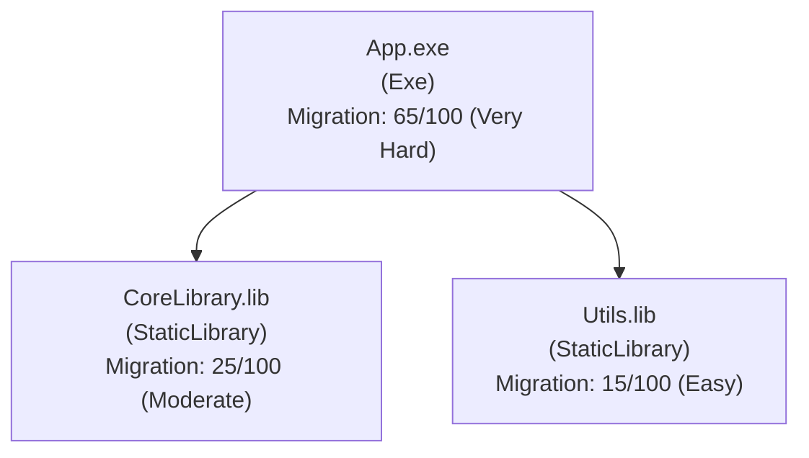

# Solution Dependency Mapper

A cross-platform .NET tool (supports .NET 8 and 9, with .NET 10 support planned) that analyzes Visual Studio solutions containing mixed native (C++) and managed (.NET) projects. Supports Visual Studio 2022, 2025, and 2026. It extracts dependency relationships, identifies project types and outputs, and generates visual diagrams and build scripts to facilitate migration and modernization of legacy C++ ecosystems.

## 🎯 Overview

This tool helps you understand and migrate complex Visual Studio solutions by:
- **Mapping dependencies** between all projects in your solution
- **Visualizing relationships** with interactive diagrams
- **Scoring migration difficulty** for each project (0-100 scale)
- **Generating build scripts** for automated, dependency-aware builds
- **Detecting issues** like circular dependencies and build order problems

## ✨ Features

### Core Features
- ✅ **Solution Parsing** - Parse `.sln` files and extract all project paths
- ✅ **Project Analysis** - Parse `.vcxproj` and `.csproj` files using MSBuild
- ✅ **Dependency Extraction** - Extract project and external dependencies
- ✅ **Graph Construction** - Build complete dependency graph with cycle detection
- ✅ **JSON Output** - Machine-readable dependency tree with migration scores
- ✅ **MermaidJS Output** - Visual diagram in Markdown format (renders on GitHub)
- ✅ **Draw.io Output** - Professional diagram in XML format

### Addon Features
- ✅ **Build Layer Analysis** - Topological sorting into build layers
- ✅ **Cycle Detection** - Detect and report circular dependencies
- ✅ **Build Script Generation** - Generate platform-specific build scripts (PowerShell, Batch, Shell)
- ✅ **Tool Discovery** - Automatically discover Visual Studio tools, CMake, and C++ build tools at startup
- ✅ **Automatic Package Installation** - Automatically installs missing Microsoft.Build packages and retries parsing
- ✅ **Project Type Detection** - Identifies project types (C# Project, C++ Project, etc.) from file extensions
- ✅ **ToolsVersion Reporting** - Extracts and reports MSBuild ToolsVersion for each project
- ✅ **Solution Summary Report** - Comprehensive report with project types, ToolsVersion distribution, and statistics
- ✅ **Error Resilience** - Continues parsing all projects even when individual projects fail
- ⏳ **CMake Generation** - Auto-generate CMakeLists.txt (pending)

### Advanced Features
- ✅ **Migration Scoring** - Automatic difficulty scoring (0-100) for migrating projects to cross-platform, included in JSON and Mermaid outputs

## 📋 Requirements

- .NET 8.0 or 9.0 SDK (the tool supports both versions, .NET 10 support planned)
- MSBuild (via MSBuildLocator - no Visual Studio installation required)
- Windows: PowerShell 5.1+ or PowerShell Core
- Linux/macOS: Bash shell

## 🚀 Installation

### Option 1: Clone and Build

```bash
# Clone the repository
git clone https://github.com/floradu88/arch-cplusplus-migration-tool.git
cd arch-cplusplus-migration-tool

# Restore NuGet packages
dotnet restore

# Build the project
dotnet build -c Release
```

### Option 2: Run Directly

```bash
# Run without building
dotnet run -- <path-to-solution.sln>
```

## 📖 Usage

### Basic Usage

The simplest way to use the tool is to point it at your solution file:

```bash
dotnet run -- "C:\Projects\MySolution\MySolution.sln"
```

Or if you've built it:

```bash
dotnet SolutionDependencyMapper.dll "C:\Projects\MySolution\MySolution.sln"
```

### Command-Line Options

#### `--assume-vs-env` or `--vs-env`
If you're running from VS2022 Developer Command Prompt (where MSBuild/dotnet are already configured), you can use this flag to skip MSBuildLocator registration:

```bash
dotnet run -- "C:\Projects\MySolution\MySolution.sln" --assume-vs-env
```

This flag tells the tool to use MSBuild/dotnet directly from the environment, bypassing MSBuildLocator registration checks.

#### `--find-tools` or `--tools` or `-t`
Discover and list all Visual Studio tools, CMake, and C++ build tools:

```bash
dotnet run -- --find-tools
```

Optionally specify a project root directory to search:

```bash
dotnet run -- --find-tools "C:\Projects\MySolution"
```

This command searches for tools in:
- Project root directory (if specified)
- PATH environment variable
- Common Windows installation locations
- Visual Studio directories (using vswhere.exe)

#### `--auto-install-packages` or `--auto-packages`
Enable automatic installation of missing Microsoft.Build packages (default: enabled).

When a project fails to parse due to missing Microsoft.Build packages, the tool will:
1. Automatically detect the missing package error
2. Install the required `Microsoft.Build*` NuGet packages (version `15.1.548`) inferred from the error message (for example: `Microsoft.Build`, `Microsoft.Build.Framework`, `Microsoft.Build.Utilities.Core`, `Microsoft.Build.Tasks.Core`)
3. Run `dotnet restore` to restore packages
4. Retry parsing the project

```bash
dotnet run -- "MySolution.sln" --auto-install-packages
```

#### `--no-auto-install-packages` or `--no-auto-packages`
Disable automatic package installation. Projects with missing packages will fail without attempting to fix them.

```bash
dotnet run -- "MySolution.sln" --no-auto-install-packages
```

**Use cases:**
- When you want to manually fix package issues
- When you don't want the tool to modify project files
- For auditing purposes to see which projects have package issues

### Example Output

When you run the tool, you'll see progress information:

```
Discovering build tools...
Found 12 tool instances across 5 tool types.
  MSBuild: C:\Program Files\Microsoft Visual Studio\2022\Community\MSBuild\Current\Bin\MSBuild.exe
  CMake: C:\Program Files\CMake\bin\cmake.exe

Loading solution: C:\Projects\MySolution\MySolution.sln
Found 15 projects.

Parsing projects...
  Parsing: CoreLibrary.vcxproj
    ✓ Successfully parsed: CoreLibrary.vcxproj
  Parsing: Utils.vcxproj
    ✓ Successfully parsed: Utils.vcxproj
  Parsing: App.csproj
    ⚠️  Detected missing package error for App.csproj
     Attempting to install missing Microsoft.Build packages...
    ✓ Installed Microsoft.Build packages to: App.csproj
    ✓ Restored packages for: App.csproj
     Retrying parse (attempt 2/2)...
    ✓ Successfully parsed: App.csproj
  Parsing: LegacyProject.vcxproj
    ✗ Failed to parse: LegacyProject.vcxproj

Parsing Summary:
  ✓ Successfully parsed: 14 project(s)
  ✗ Failed to parse: 1 project(s)

Failed Projects:
  - LegacyProject.vcxproj: Parsing returned null (see errors above)

======================================================================
SOLUTION SUMMARY REPORT
======================================================================
Solution: MySolution.sln
Total Projects: 14

Project Types:
  C# Project: 8 project(s)
  C++ Project: 6 project(s)

ToolsVersion Distribution:
  Current: 8 project(s)
  15.0: 6 project(s)

Output Types:
  Exe: 2 project(s)
  DynamicLibrary: 5 project(s)
  StaticLibrary: 7 project(s)

Project Details:
----------------------------------------------------------------------
Project Name                   Type            ToolsVersion  Output    
----------------------------------------------------------------------
App                            C# Project      Current      Exe       
CoreLibrary                    C++ Project     15.0         StaticLibrary
Utils                          C++ Project     15.0         StaticLibrary
...

Building dependency graph...
  Nodes: 14
  Edges: 23
  Build Layers: 4
  ⚠️  Circular Dependencies: 1

Generating outputs...
  ✓ Generated: output/dependency-tree.json
  ✓ Generated: output/dependency-graph.md
  ✓ Generated: output/dependency-graph.drawio

Generating build scripts...
  ✓ Generated: output/build-layers.json
  ✓ Generated: output/build.ps1
  ✓ Generated: output/build.bat
  ✓ Generated: output/build.sh

✓ Analysis complete!

Output directory: C:\Projects\MySolution\output
```

## 📁 Output Files

All output files are written to `<solution-directory>/output/`:

### Core Outputs

#### 1. `dependency-tree.json`
Machine-readable JSON containing all project metadata, dependencies, and migration scores.

**Example:**
```json
[
  {
    "name": "CoreLibrary",
    "path": "src/Core/CoreLibrary.vcxproj",
    "projectType": "C++ Project",
    "toolsVersion": "15.0",
    "outputType": "StaticLibrary",
    "outputBinary": "bin/Release/CoreLibrary.lib",
    "targetName": "CoreLibrary",
    "targetExtension": ".lib",
    "targetFramework": null,
    "projectDependencies": [],
    "externalDependencies": [],
    "properties": {
      "Configuration": "Release",
      "Platform": "x64"
    },
    "migrationScore": 25,
    "migrationDifficultyLevel": "Moderate"
  },
  {
    "name": "App",
    "path": "src/App/App.csproj",
    "projectType": "C# Project",
    "toolsVersion": "Current",
    "outputType": "Exe",
    "outputBinary": "bin/Release/App.exe",
    "targetName": "App",
    "targetExtension": ".exe",
    "targetFramework": "net8.0",
    "projectDependencies": [
      "src/Core/CoreLibrary.vcxproj"
    ],
    "externalDependencies": [
      "System.Runtime",
      "System.Console"
    ],
    "properties": {
      "Configuration": "Release",
      "Platform": "AnyCPU"
    },
    "migrationScore": 15,
    "migrationDifficultyLevel": "Easy"
  }
]
```

**Use Cases:**
- Programmatic analysis
- CI/CD integration
- Migration planning tools
- Custom reporting

#### 2. `dependency-graph.md`
MermaidJS diagram that renders automatically on GitHub, GitLab, and most Markdown viewers.

**Features:**
- Interactive dependency graph
- Color-coded by project type
- Project type and ToolsVersion displayed in nodes
- Migration scores displayed in nodes
- Project types and ToolsVersion statistics section
- Build layers section with project metadata
- Circular dependency warnings

**Example visualization:**


**Viewing:**
- GitHub: Automatically renders in repository
- VS Code: Install "Markdown Preview Mermaid Support" extension
- Online: Copy to [Mermaid Live Editor](https://mermaid.live/)

#### 3. `dependency-graph.drawio`
Professional diagram in Draw.io XML format.

**Features:**
- Layered layout based on build order
- Color-coded nodes
- Export to PNG, SVG, PDF

**Usage:**
1. Open [draw.io](https://app.diagrams.net/) or diagrams.net
2. File → Open → Select `dependency-graph.drawio`
3. Edit, export, or share

### Build Scripts (Addon)

#### 4. `build-layers.json`
Machine-readable build layer structure.

**Example:**
```json
{
  "layers": [
    {
      "layer": 0,
      "projects": [
        {
          "name": "Utils",
          "path": "src/Utils/Utils.vcxproj",
          "outputType": "StaticLibrary"
        }
      ]
    },
    {
      "layer": 1,
      "projects": [
        {
          "name": "CoreLibrary",
          "path": "src/Core/CoreLibrary.vcxproj",
          "outputType": "StaticLibrary"
        }
      ]
    },
    {
      "layer": 2,
      "projects": [
        {
          "name": "App",
          "path": "src/App/App.vcxproj",
          "outputType": "Exe"
        }
      ]
    }
  ],
  "cycles": []
}
```

#### 5. `build.ps1` (PowerShell)
Windows PowerShell build script with automatic MSBuild detection.

**Usage:**
```powershell
# Run from solution directory
.\output\build.ps1

# Or from any directory
cd C:\Projects\MySolution
.\output\build.ps1
```

**Features:**
- Automatically locates MSBuild (PATH, vswhere, or common locations)
- Builds projects in dependency order
- Error handling with clear messages
- Progress output

**Example output:**
```
=== Building Solution in Dependency Order ===
Configuration: Release
Platform: x64
Using MSBuild: C:\Program Files\Microsoft Visual Studio\2022\Community\MSBuild\Current\Bin\MSBuild.exe

=== Layer 0 ===
  Building: Utils (StaticLibrary)
  Building: CoreLibrary (StaticLibrary)

=== Layer 1 ===
  Building: App (Exe)

=== Build Complete ===
```

#### 6. `build.bat` (Batch)
Windows CMD batch script for environments without PowerShell.

**Usage:**
```cmd
REM Run from solution directory
output\build.bat

REM Or from any directory
cd C:\Projects\MySolution
output\build.bat
```

**Features:**
- Works in standard CMD prompt
- Automatic MSBuild detection
- Compatible with older Windows systems

#### 7. `build.sh` (Shell)
Linux/macOS shell script for CMake-based builds.

**Usage:**
```bash
# Make executable (first time only)
chmod +x output/build.sh

# Run from solution directory
./output/build.sh

# Or from any directory
cd /path/to/solution
./output/build.sh
```

**Note:** This script assumes you have a CMake build system. For MSBuild-based projects, use the Windows scripts.

## 🔍 Migration Scoring

The tool automatically calculates migration difficulty scores (0-100) for each project:

- **0-19: Easy** - Minimal changes needed, mostly cross-platform compatible
- **20-39: Moderate** - Some Windows-specific code, manageable migration
- **40-59: Hard** - Significant Windows dependencies, requires refactoring
- **60-79: Very Hard** - Heavy Windows-specific code (MFC, COM, etc.)
- **80-100: Extremely Hard** - Deeply integrated with Windows, major rewrite needed

### Scoring Factors

1. **Project Type** (0-20 points)
   - Managed .NET projects: Lower score
   - Native C++ projects: Higher score
   - Executables: Additional points

2. **Windows Dependencies** (0-30 points)
   - Win32 APIs, MFC, ATL, COM
   - Windows-specific libraries
   - DirectX, Winsock, etc.

3. **Complexity** (0-15 points)
   - Number of dependencies
   - Circular dependencies
   - Project structure complexity

4. **External Dependencies** (0-20 points)
   - Platform-specific libraries
   - Third-party dependencies

5. **Build System** (0-15 points)
   - Legacy Visual Studio versions
   - Complex build configurations

### Viewing Migration Scores

**In JSON:**
```json
{
  "name": "MyProject",
  "migrationScore": 45,
  "migrationDifficultyLevel": "Hard"
}
```

**In Mermaid Diagram:**
- Scores appear in node labels
- Border colors indicate difficulty:
  - 🟢 Green: Easy
  - 🟡 Yellow: Moderate
  - 🟠 Orange: Hard
  - 🔴 Red: Very Hard
  - ⚫ Dark Red: Extremely Hard

**In Markdown:**
The `dependency-graph.md` includes a "Migration Scores" section grouping projects by difficulty level.

## 🏗️ Project Structure

```
SolutionDependencyMapper/
├── Core/
│   ├── SolutionLoader.cs          # Parse .sln files
│   ├── ProjectParser.cs            # Parse .vcxproj/.csproj
│   └── DependencyGraphBuilder.cs   # Build dependency graph
├── Models/
│   ├── ProjectNode.cs              # Project data model
│   ├── DependencyGraph.cs          # Graph data model
│   ├── DependencyEdge.cs           # Edge data model
│   └── BuildLayer.cs                # Build layer data model
├── Output/
│   ├── JsonGenerator.cs            # JSON output generator
│   ├── MermaidGenerator.cs         # MermaidJS generator
│   ├── DrawioGenerator.cs          # Draw.io generator
│   └── BuildScriptGenerator.cs     # Build script generator
├── Utils/
│   ├── ToolFinder.cs              # Tool discovery utility
│   ├── ToolsContext.cs             # Tools context storage
│   ├── PackageInstaller.cs        # Automatic package installation utility
│   ├── TopologicalSorter.cs       # Topological sort algorithm
│   ├── CycleDetector.cs            # Cycle detection algorithm
│   └── MigrationScorer.cs         # Migration difficulty scoring
├── Program.cs                       # Entry point
├── SolutionDependencyMapper.csproj
├── README.md                        # This file
└── ARCHITECTURE.md                  # Detailed architecture documentation
```

## 📊 Supported Project Types

- **Native C++**: `.vcxproj` (Visual Studio C++ projects)
- **Managed .NET**: `.csproj` (C# projects)
  - .NET Framework (all versions)
  - .NET Core 3.1+
  - .NET 5.0+
  - .NET 6.0+
  - .NET 7.0+
  - .NET 8.0+
  - .NET 9.0+
  - .NET 10.0+ (when available)
- **Mixed**: Solutions containing both native and managed projects

## 🔧 Supported Solution Formats

- Visual Studio 2010 and later (`.sln` format)
- **Fully tested with**: VS2010, VS2015, VS2017, VS2019, VS2022, VS2025, VS2026
- **Tool discovery supports**: VS2022, VS2025, VS2026 (64-bit), VS2019, VS2017 (32-bit)

## 🌍 Platform Support

- ✅ Windows (x64, x86)
- ✅ Linux (x64, ARM64)
- ✅ macOS (x64, ARM64)

## 💡 Use Cases

### 1. Legacy Solution Analysis
Understand complex, multi-year-old solutions:
```bash
dotnet run -- "LegacySolution.sln"
# Review dependency-graph.md to understand structure
# Check solution summary report for project types and ToolsVersion distribution
```

### 2. Migration Planning
Identify migration priorities:
```bash
dotnet run -- "MySolution.sln"
# Check migration scores in dependency-tree.json
# Review project types and ToolsVersion to identify modernization needs
# Focus on "Easy" projects first
```

### 3. Build Automation
Generate build scripts for CI/CD:
```bash
dotnet run -- "MySolution.sln"
# Use generated build.ps1 in Azure DevOps, GitHub Actions, etc.
# Build scripts automatically use discovered tool paths
```

### 4. Documentation
Create visual documentation:
```bash
dotnet run -- "MySolution.sln"
# Include dependency-graph.md in project documentation
# Export dependency-graph.drawio to PNG for presentations
# Solution summary report provides comprehensive project overview
```

### 5. Dependency Audit
Find circular dependencies and issues:
```bash
dotnet run -- "MySolution.sln"
# Review cycles in dependency-graph.md
# Check build-layers.json for build order
# All projects are parsed even if some fail
```

### 6. Project Modernization Assessment
Assess solution modernization needs:
```bash
dotnet run -- "MySolution.sln"
# Review ToolsVersion distribution to identify projects needing updates
# Check project types to understand technology mix
# Use solution summary report for planning modernization efforts
```

## 🐛 Troubleshooting

### MSBuild Not Found / MSBuildLocator Not Registered
**Error:** `No MSBuild instances found` or `MSBuildLocator is not registered`

The tool automatically discovers MSBuild using ToolFinder, but MSBuildLocator (required for parsing project files) needs Visual Studio to be properly registered.

**Solutions:**
1. **Use `--assume-vs-env` flag (Recommended for VS Developer Command Prompt)**
   - If running from VS2022 Developer Command Prompt, use: `dotnet run -- "solution.sln" --assume-vs-env`
   - This bypasses MSBuildLocator registration and uses MSBuild/dotnet directly from the environment

2. **Install Visual Studio or Build Tools**
   - Download: https://visualstudio.microsoft.com/downloads/
   - Ensure the "MSBuild" workload is installed

3. **Run from Developer Command Prompt**
   - Use "Developer Command Prompt for VS" or "Developer PowerShell for VS"
   - These set up the environment correctly for MSBuildLocator
   - Or use `--assume-vs-env` flag when running from these prompts

4. **Repair Visual Studio Installation**
   - Open Visual Studio Installer
   - Click "Modify" → "Repair"

5. **Check Tool Discovery**
   - Run `dotnet run -- --find-tools` to see if MSBuild is discovered
   - If found via ToolFinder but MSBuildLocator fails, Visual Studio registration is the issue

6. **Note:** The generated build scripts will use discovered MSBuild paths even if MSBuildLocator fails

### Project Parsing Errors
**Error:** `Failed to parse: ProjectName.csproj` or `Error parsing project`

The tool now continues parsing all projects even when individual projects fail. Failed projects are tracked and reported in the summary.

**Solutions:**
1. **Automatic Package Installation**
   - The tool detects **Microsoft.Build* assembly/type load failures** during parsing
   - Automatically installs the required `Microsoft.Build*` packages (version `15.1.548`) **based on the error message**
   - Runs `dotnet restore` automatically
   - Retries parsing after package installation

2. **Check Error Messages**
   - Review the "Failed Projects" section in the output
   - Each failed project shows the specific error message
   - Fix the project file based on the error

3. **Manual Package Installation**
   - If automatic installation fails, manually add missing packages:
   ```xml
   <ItemGroup>
     <PackageReference Include="Microsoft.Build" Version="15.1.548" />
     <PackageReference Include="Microsoft.Build.Framework" Version="15.1.548" />
     <PackageReference Include="Microsoft.Build.Utilities.Core" Version="15.1.548" />
     <PackageReference Include="Microsoft.Build.Tasks.Core" Version="15.1.548" />
   </ItemGroup>
   ```
   - Then run `dotnet restore` on the project

4. **Verify Project File Format**
   - Ensure the project file is valid XML
   - Check for syntax errors in the project file
   - Verify project references are correct

### No Projects Found
**Error:** `No projects found in solution`

**Solutions:**
1. Verify the solution file is valid
2. Check that projects are not excluded
3. Ensure project paths are correct

### Permission Denied (Linux/macOS)
**Error:** Permission denied when running build.sh

**Solution:**
```bash
chmod +x output/build.sh
```

## 📚 Architecture

See [ARCHITECTURE.md](ARCHITECTURE.md) for detailed architecture documentation, including:
- System architecture diagrams
- Component specifications
- Algorithm details
- Data models
- Output format specifications

## 🤝 Contributing

Contributions are welcome! Please feel free to submit a Pull Request.

## 📄 License

[Specify your license here]

## 🔗 Links

- **Repository:** https://github.com/floradu88/arch-cplusplus-migration-tool
- **Issues:** https://github.com/floradu88/arch-cplusplus-migration-tool/issues
- **Architecture Docs:** [ARCHITECTURE.md](ARCHITECTURE.md)

## 🙏 Acknowledgments

Built with:
- .NET 8.0
- MSBuild API
- MermaidJS
- Draw.io

---

**Made with ❤️ for modernizing legacy C++ ecosystems**
